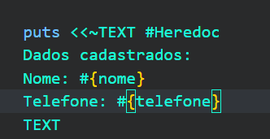

## Uso de Herança
> Herança é útil quando uma classe é um tipo de outra classe. 

Por exemplo, se você tivesse uma classe ClinicaEspecializada que herda de Clinica, faria sentido. No caso do Menu, ele não é um tipo de Clinica, mas sim uma classe que usa a Clinica para realizar operações. Portanto, a relação mais adequada aqui é de composição, não de herança.

## Dar o nome para a clínica
Não era uma das tarefas, mas caso queira dar nome à clínica, basta adicionar o método nomear_clinica à classe clínica e adicionar #{@clinica.nome}

```
def nomear_clinica
    if @Clinica.nome == nil || @Clinica.nome.empty?
            puts "Digite o nome da sua clínica: "
            clinica.nome = gets.chomp
        end
end
```

## Usar recursão para otimizar o código
ao invés de fazer o clássico do..while
> Recursão é quando um método chama a si mesmo. 

Podemos usar recursão para manter o menu em execução até que o usuário escolha sair. Essa abordagem é mais elegante e evita o uso de loop ou while. 

recursão no método exibir_menu

[recursão_exibir_menu](C:\Education\education_side_projects\clinica_poo\clinica_ruby\recursao.png)

## Comportamento das IDEs
O Eclipse vai criar automaticamente pastas como src (para código-fonte) e bin (para arquivos compilados).

## Métodos de instância x Métodos da classe
 > Método de Instância 
 Um método de instância opera em uma instância específica de uma classe (ou seja, um objeto). Ele acessa e modifica atributos do objeto (@nome, @telefone, etc.). Métodos de instância só podem ser chamados após criar um objeto (objeto.metodo).

 | Característica          | Método de Instância                          | Método de Classe                          |
|-------------------------|---------------------------------------------|-------------------------------------------|
| **Acesso a atributos**  | Acessa atributos do objeto (`@nome`, etc.). | Não acessa atributos de instância.        |
| **Chamada**             | `objeto.metodo`                             | `Classe.metodo`                           |
| **Uso**                 | Modificar/consultar dados de um objeto.     | Operações gerais da classe (ex.: factory).|
| **Ruby**                | `def metodo`                                | `def self.metodo`                         |
| **Java**                | `void metodo()`                             | `static void metodo()`                    |
| **PHP**                 | `public function metodo()`                  | `public static function metodo()`         |

## Composição na Prática
A classe Clinica é composta por objetos de outras classes (Paciente, Consulta), ou seja:

A clínica tem uma lista de pacientes (@pacientes) e 
A clínica tem uma lista de consultas (@consultas).

Esses atributos (@pacientes e @consultas) são objetos independentes que existem apenas no contexto de uma instância específica da Clinica. Por isso, os métodos que manipulam esses atributos devem ser métodos de instância.

## Heredoc 
Heredoc (<<~TEXT) permite escrever strings multilinha com formatação natural.

Usar apenas um puts evita linhas em branco extras que aparecem quando você usa múltiplos puts




## Níveis de acesso: Métodos protegidos x métodos privados
> Em Ruby, métodos privados só podem ser chamados dentro do próprio objeto, não podem ter um receptor explícito. Métodos protegidos podem ser chamados por qualquer instância da classe ou de classes derivadas.

Privados (private): Só podem ser chamados dentro da própria classe.
> Para validações internas, use `private`!

Protegidos (protected): Podem ser chamados por outras instâncias da mesma classe ou subclasses.

| Característica       | `private`                                 | `protected`                               |
|----------------------|-------------------------------------------|-------------------------------------------|
| **Acesso**           | Só dentro da própria classe.             | Na própria classe e em subclasses.        |
| **Visibilidade**     | Não pode ser chamado por outras classes. | Pode ser chamado por instâncias da mesma classe ou herdeiras. |
| **Uso Típico**       | Validações internas, métodos auxiliares. | Métodos que precisam de acesso entre classes relacionadas. |
| **Exemplo**          | `validar_nome` na classe `Paciente`.     | Método compartilhado entre `Paciente` e uma subclasse `PacienteVIP`. |


## Tratamento de erros em Ruby
> Ruby usa o bloco de código para `begin - rescue ou raise`

Em analogia ao try-catch

| Característica       | **Ruby**                                  | **PHP**                                   |
|----------------------|-------------------------------------------|-------------------------------------------|
| Início do bloco      | `begin`                                   | `Try`                                     |
| Lançar Erros         | `rescue`                                  | `Throw`                                   |
| Capturar e tratar Erros  | `begin`                               | `catch`                                   |
| Bloco de Limpeza     |  `ensure`                                 | `finally`                                 |
| Tipo de Erro         |  `Exception`, `StandardError`, customizado| `Exception`, `Throwable`, customizado     |

1. Início do Bloco
> Iniciar um bloco onde erros podem ocorrer. Envolver o código que pode gerar exceções.

2.  Lançar Erros
> Lançar uma exceção.

3. Capturar e tratar Erros
> capturar e tratar exceções.

4. Bloco de Limpeza
> executar código independentemente de erros.

### Herança dos erros
Em Ruby, a maioria das exceções são herdadas de StandardError; em PHP, são herdadas de Throwable.


