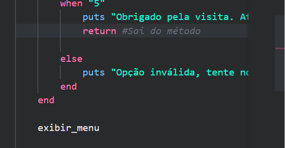

## Uso de Herança
> Herança é útil quando uma classe é um tipo de outra classe. 

Por exemplo, se você tivesse uma classe ClinicaEspecializada que herda de Clinica, faria sentido. No caso do Menu, ele não é um tipo de Clinica, mas sim uma classe que usa a Clinica para realizar operações. Portanto, a relação mais adequada aqui é de composição, não de herança.

## Dar o nome para a clínica
Não era uma das tarefas, mas caso queira dar nome à clínica, basta adicionar o método nomear_clinica à classe clínica e adicionar #{@clinica.nome}

```
def nomear_clinica
    if @Clinica.nome == nil || @Clinica.nome.empty?
            puts "Digite o nome da sua clínica: "
            clinica.nome = gets.chomp
        end
end
```

## Usar recursão para otimizar o código
ao invés de fazer o clássico do..while
> Recursão é quando um método chama a si mesmo. 

 Podemos usar recursão para manter o menu em execução até que o usuário escolha sair. Essa abordagem é mais elegante e evita o uso de loop ou while. 

 recursão no método exibir_menu !
 